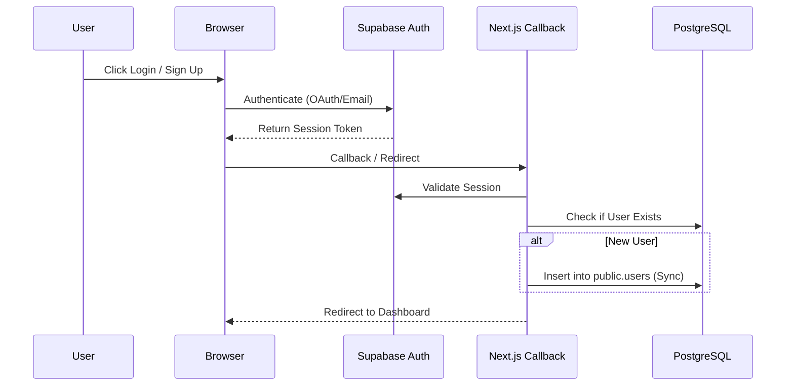
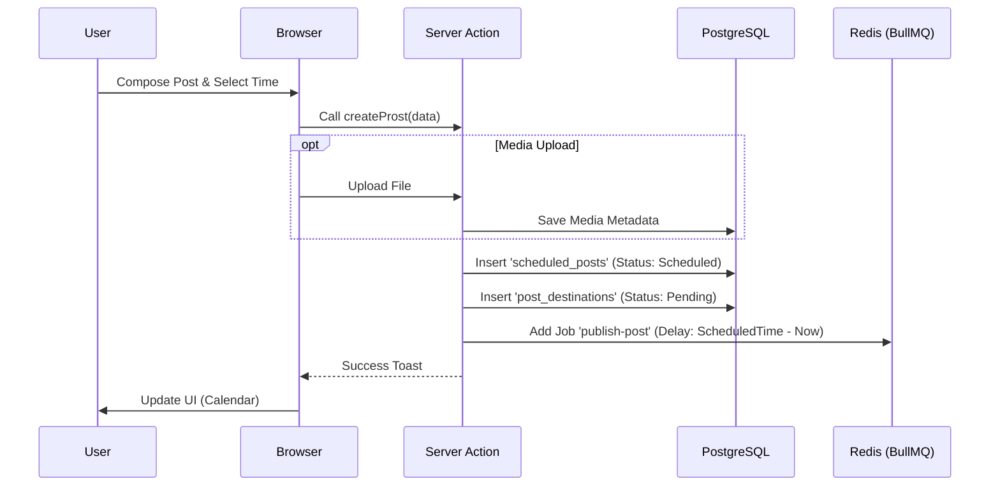
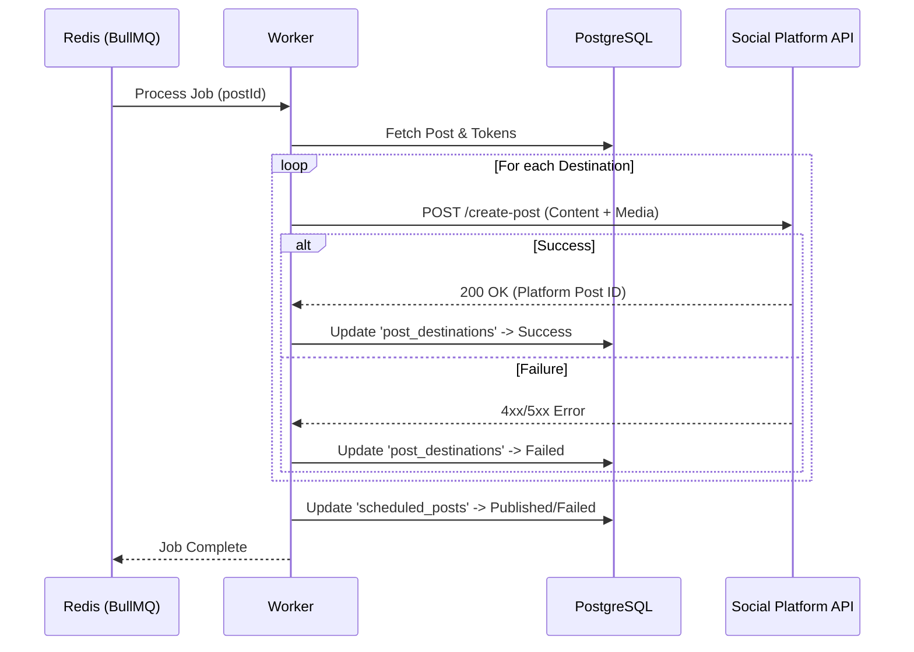
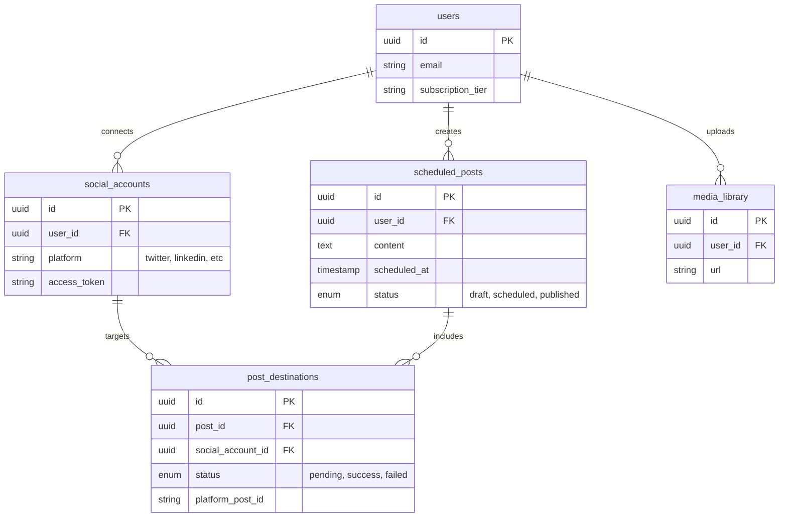

# System Architecture

## 1. High-Level Overview

The **Social Media Scheduler** is a full-stack SaaS application built on the **Modern Data Stack**. It uses **Next.js 14** for the frontend and API layer, **Supabase** for authentication and object storage, and a custom **Worker** service for handling background job processing (scheduling and publishing posts).

### Core Components

1.  **Web Application (Next.js App Router)**
    *   **Frontend**: React Server Components (RSC) and Client Components using `shadcn/ui` and TailwindCSS.
    *   **Backend-for-Frontend (BFF)**: Next.js Server Actions and Route Handlers for business logic.
    *   **Database Access**: Drizzle ORM connecting to PostgreSQL.
    
2.  **Database Layer (PostgreSQL)**
    *   Hosted on Supabase (or any Postgres provider).
    *   Manages users, connected social accounts, scheduled posts, and media metadata.
    *   Uses **Drizzle ORM** for type-safe database interactions.

3.  **Authentication & Storage (Supabase)**
    *   **Auth**: Handles signup, login, and OAuth flows (Google, Github, etc.).
    *   **Storage**: Buckets for storing user-uploaded media (images/videos).

4.  **Async Task Queue (Redis + BullMQ)**
    *   **Redis**: In-memory data store used as the message broker.
    *   **BullMQ**: Handles job scheduling (delayed jobs) and retries.

5.  **Worker Service (Node.js)**
    *   A separate process that consumers jobs from the Queue.
    *   Executes the actual publishing logic to social media platforms (Twitter, LinkedIn, etc.) via their respective APIs.

---

## 2. System Context Diagram

```mermaid
graph TD
    User[End User]
    
    subgraph "Frontend / Client"
        Browser[Web Browser]
    end
    
    subgraph "Application Server (Next.js)"
        ServerActions[Server Actions]
        API[API Routes]
    end
    
    subgraph "Infrastructure"
        DB[(PostgreSQL)]
        Redis[(Redis Queue)]
        SupabaseAuth[Supabase Auth]
        SupabaseStorage[Supabase Storage]
    end
    
    subgraph "Background Services"
        Worker[Node.js Worker]
    end
    
    subgraph "External APIs"
        SocialAPIs[Social Media APIs\n(Twitter, LinkedIn, FB)]
    end

    User --> Browser
    Browser --> |HTTP Request| ServerActions
    Browser --> |HTTP Request| API
    
    ServerActions --> |Read/Write| DB
    ServerActions --> |Enqueue Job| Redis
    ServerActions --> |Upload| SupabaseStorage
    
    Browser --> |Auth| SupabaseAuth
    SupabaseAuth --> |Callback| API
    
    Worker --> |Poll| Redis
    Worker --> |Fetch Data| DB
    Worker --> |Publish| SocialAPIs
    Worker --> |Update Status| DB
```

---

## 3. Core Workflows

### 3.1 Authentication & User Sync Flow

This flow ensures that users authenticated via Supabase are correctly synced to our internal `users` table for relational data integrity.



### 3.2 Post Scheduling Flow

How a user creates a post and schedules it for later.



### 3.3 Post Publishing Flow (Worker)

The background process that actually publishes the content when the scheduled time arrives.



---

## 4. Database Schema (ERD)

A simplified Entity-Relationship Diagram focusing on the core scheduling logic.


